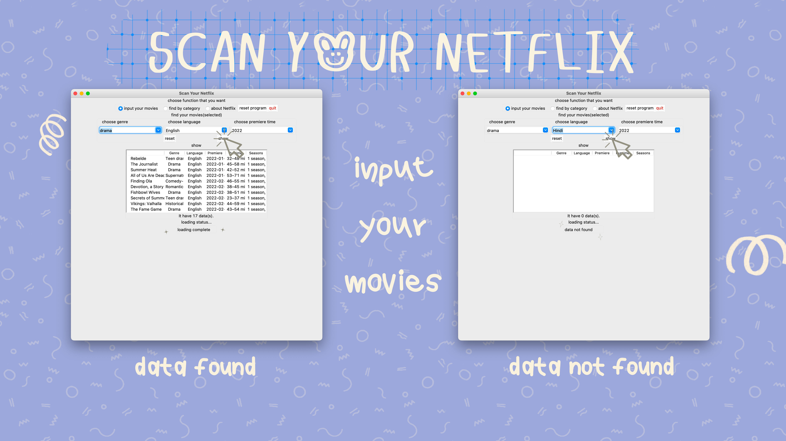
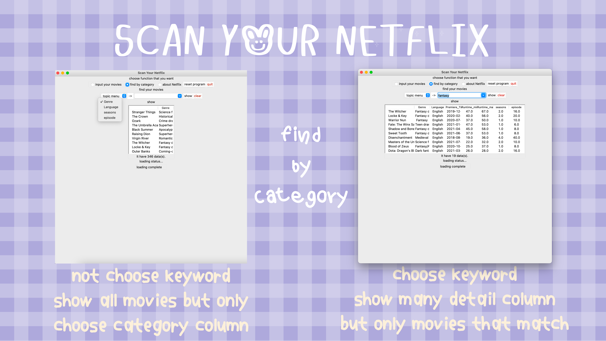
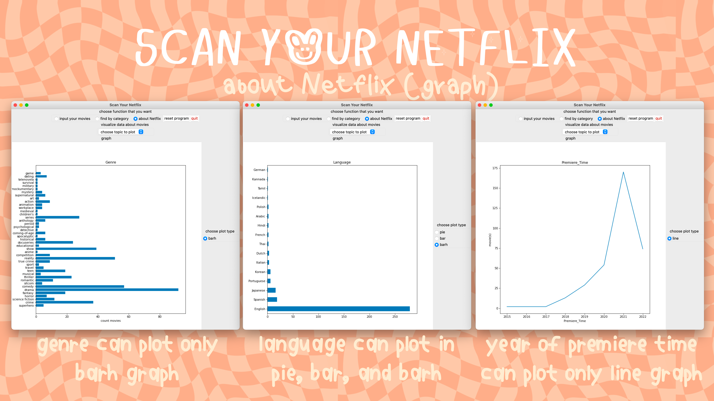

# compro2-project
## Description

This is an application that can sort movies in Netflix. It has 3 functions inside this program that is input your
movies, find by category, and about Netflix.About Netflix is about plot data in genre, language, and year of premiere
time. Input your movies and find by category are similarly that it will sort by keyword in each category.

How different between input your movies and find by category function?

- Input your movies can choose 3 keyword of genre, language, and year of premiere time ,but you needn't input all
  keyword(premiere time is set automatically)
- Find by category can choose only one column to sorted them. If you didn't choose keyword of that column that you want,
  it will show all about this column

Original data from : https://www.kaggle.com/datasets/timmofeyy/current-netflix-projects

This is link to demonstration my program.👉🏻
https://youtu.be/O0LbUpvZqEY

An example of this program👇🏻

## Running the Application

This program need packages pandas, matplotlib, tkinter, and numpy to run this program. You can run this program in
main.py
